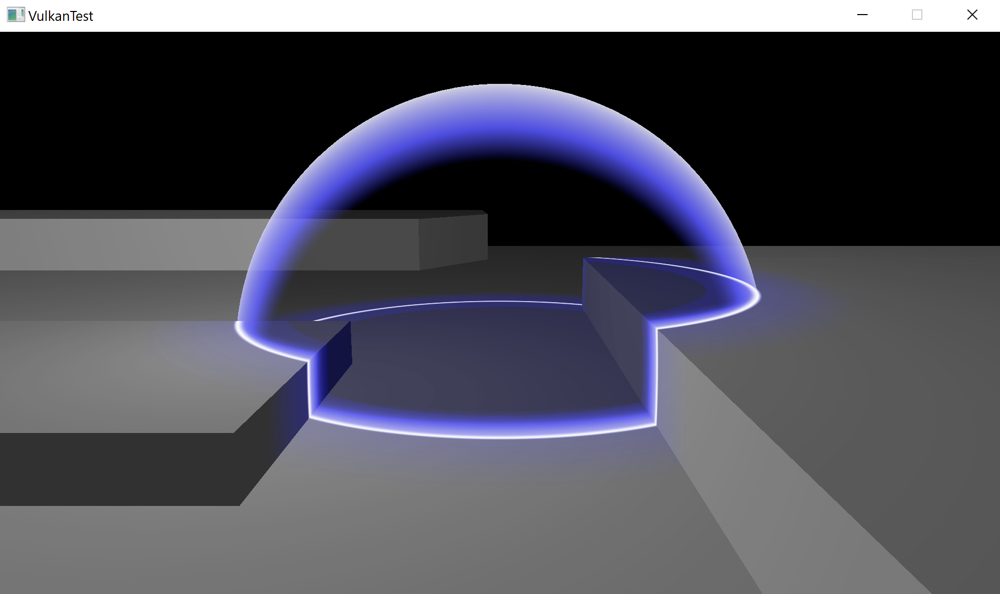
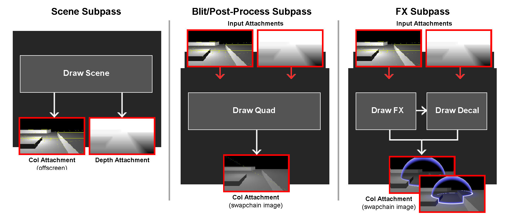

Vulkan subpasses example:
-------------------------
Vulkan example utilizing subpasses to implement multiple passes:
1. Scene subpass: The shaded opaque scene is drawn into color and depth attachments.
2. Blit/Post-Process subpass: Apply tonemapping and draw the scene's color attachment into the swapchain image.
3. FX subpass:  Draws the transparent effects, as well as decal projection.



Input depth attachment is used to reconstrut the scene's world position, in order to implement two effects:
1. Force field effect: scene's world position is compared with the effect's, to achieve a glow effect.
2. Decal projection effect: scene's world position is transformed to the decal's object space - used for bounding box clipping and texture coordinates.



Subpasses and "subpassLoad" optimize for tile-based architecture, by accessing tiles of the attachments stored in fast-access GPU memory.
https://arm-software.github.io/vulkan_best_practice_for_mobile_developers/samples/performance/render_subpasses/render_subpasses_tutorial.html


To configure and build the project:
-------------------------------
// configure and generate project

```
cmake -H<source_dir> -B<build_dir> -G <build_generator> -DCMAKE_TOOLCHAIN_FILE="<vcpkg_dir>\scripts\buildsystems\vcpkg.cmake"
for example: 'cmake -H. -B_vsbuild -G "Visual Studio 16 2019" -DCMAKE_TOOLCHAIN_FILE="C:\vcpkg\scripts\buildsystems\vcpkg.cmake"'
```

// build example
```
cmake --build <build_dir>
```